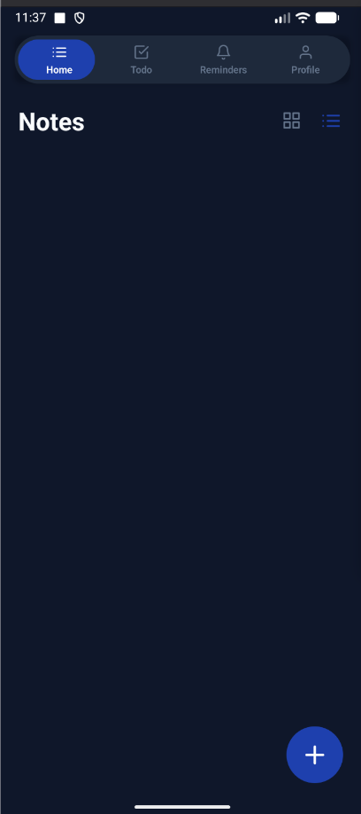
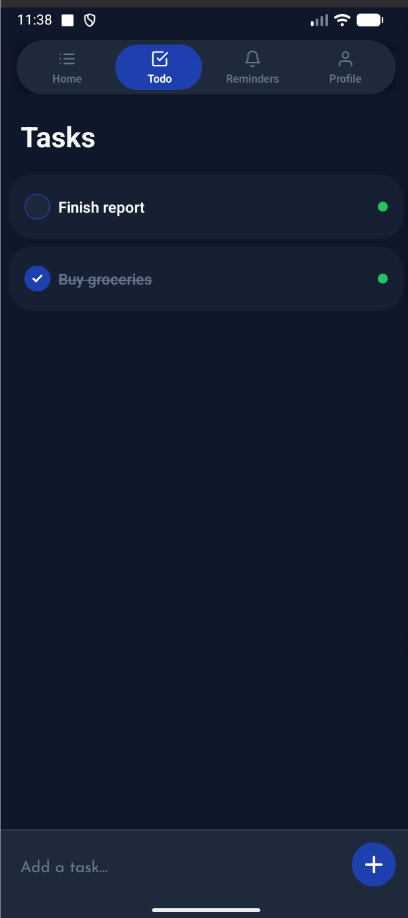
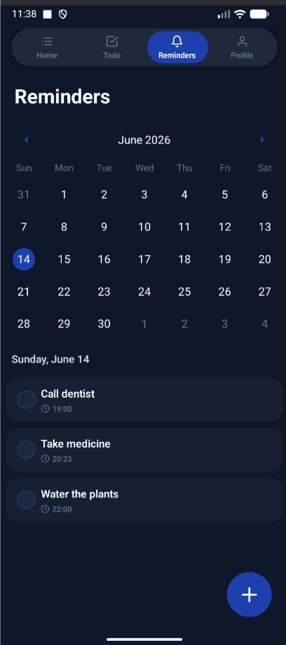
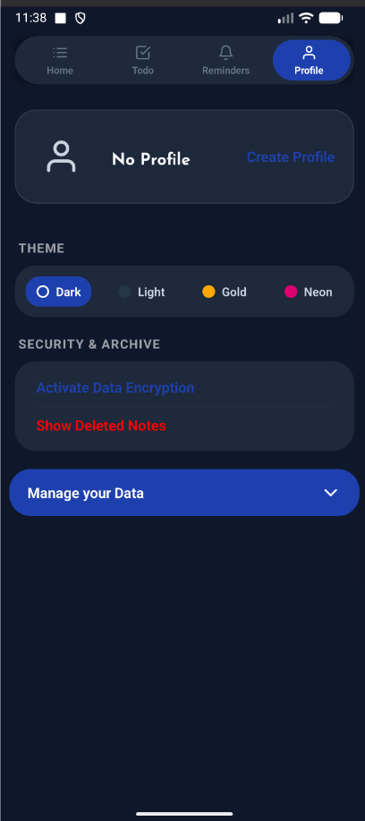
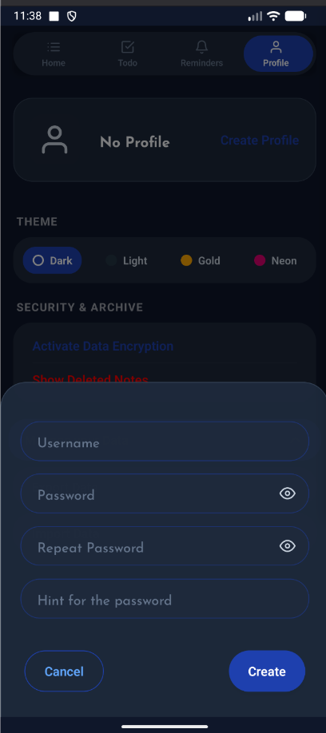

# Safe Note

A privacy-focused mobile app to write notes, manage to-dos and set reminders — all stored locally on your device.

- **Encrypted notes** — every note can be protected with an encryption key that only you know.
- **To-Do list** — keep track of daily tasks with simple checkboxes.
- **Reminders** — schedule local notifications on a calendar so you never miss a thing.
- **Profile lock** — create a profile with a password to require authorization before opening the app.
- **Themes** — switch between Dark, Light, Gold and Neon.
- **Archive** — deleted notes go to an archive where they can be recovered or removed for good.
- **Export / Import** — export your (encrypted) data as text to back it up elsewhere, and import it back later using the same encryption key.

The project is open to contributors.

## Tools & Tech Stack

- [React Native](https://reactnative.dev/) `0.78` + [React](https://react.dev/) `19`
- [TypeScript](https://www.typescriptlang.org/)
- [React Navigation](https://reactnavigation.org/) (stack & material top tabs)
- [AsyncStorage](https://react-native-async-storage.github.io/async-storage/) for local data persistence
- [crypto-es](https://github.com/entronad/crypto-es) for note encryption/decryption
- [Notifee](https://notifee.app/) for local reminder notifications
- [react-native-calendars](https://github.com/wix/react-native-calendars) for the reminders calendar
- [react-native-reanimated](https://docs.swmansion.com/react-native-reanimated/) & [react-native-gesture-handler](https://docs.swmansion.com/react-native-gesture-handler/) for animations and gestures
- [react-native-vector-icons](https://github.com/oblador/react-native-vector-icons) for icons
- [Jest](https://jestjs.io/), [ESLint](https://eslint.org/) & [Prettier](https://prettier.io/) for testing and code quality

## Install libraries
```bash
/> yarn install
/> cd ios && pod install
```

## Start application
- yarn start

#### Run on android
- yarn run android

#### Run on ios
- yarn run ios

## Visit releases page to download specific build for your android
https://github.com/Datto27/safe-note-rn/releases

# Showcase

## Notes, To-Do & Reminders
<div style="display: flex; width: 100%; justify-content: space-between">
  
  
  
  
</div>

## Profile & Themes
<div style="display: flex; width: 100%; justify-content: space-between">
  
</div>
